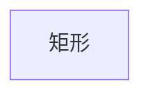
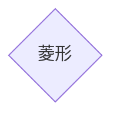
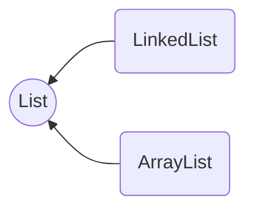

# 前面的话:
## mermaid用法
- mermaid中的图形:
### 流程图/UML 图形:
#### 矩形:

```mermaid
graph LR
    A[矩形]
```
#### 圆角矩形:

```mermaid
graph LR
    A(圆角矩形)
```
#### 圆形:

```mermaid
graph LR
    A((圆形))
```
#### 菱形:

```mermaid
graph LR
    A{菱形}
```


# 正文:
## Class关系

```mermaid
graph RL
    A(LinkedList) --> B((List))
    C(ArrayList) --> B
```

## UML类图:
```uml
+ getCurrentSize() : Integer
```


